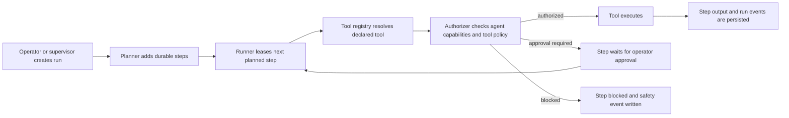

# Hydra Agent Runtime V1

Hydra Agent is the clean runtime continuation of Hydra-X. It deliberately drops
the old product-management workspace and keeps the core advantage: durable,
inspectable, policy-governed agents.

## Core Model

- **Workspace**: the security and knowledge boundary for agents, runs, graph data, providers, and policies.
- **Agent profile**: a specialized worker or supervisor with its own role, prompt, model route, skills, memory scopes, knowledge scopes, and capability profile.
- **Run**: the durable unit of autonomous work. Runs contain steps, approvals, outputs, errors, tool summaries, and recovery state.
- **Run event**: append-only timeline entries for run and step changes. These are the control-plane audit trail.
- **Conversation**: channel-specific interaction history, optionally linked to a run.
- **Knowledge graph**: workspace-scoped nodes and relationships for evidence, memories, artifacts, risks, decisions, task context, and source-grounded facts.
- **Skill**: durable workspace instruction package with trigger conditions, required tools, eval metadata, and a lifecycle.
- **Tool policy**: least-privilege grants for tools and side-effect classes.
- **Safety event**: workspace-scoped security, approval, provider, policy, and runtime incident records.

## Execution Flow

## Security Defaults

Agents are read-only unless their pack and policy explicitly grant more.
Dangerous side effects include workspace writes, shell, browser, network, MCP,
external delivery, and plugin installation. Any dangerous grant must require
approval by default.

Run steps use leases with heartbeats. A runner must acquire a lease before it
can execute a step, and stale leases can be recovered back to `planned` or
marked `failed` after the configured attempt limit. This is the first OTP-shaped
runtime advantage: many workers can compete for work without double-executing a
step.

Parallel-safe read steps can also be leased in bounded batches. The batch
runner only selects planned steps whose tool metadata is `parallel_safe: true`
and whose side-effect class is `read_only`, then executes them with
`Task.async_stream/3` under a configurable concurrency limit. Sensitive,
network, shell, browser, MCP, and write actions stay on the single-step
authorization and approval path.

Runs can also be driven by supervised OTP workers. A run worker leases and
executes one step at a time, continues while work completes successfully, and
stops cleanly when approval, policy blocks, or failures need operator attention.
The durable database state remains the source of truth; the process is only the
active execution vehicle. Operators can explicitly stop a worker, and canceling
a run also attempts to terminate the active worker process.

A background recovery worker periodically scans active workspaces for expired
step leases and returns them to `planned` or marks them failed after the
configured attempt limit.

## Providers

Provider configs are workspace-scoped or global rows that agents reference by
name in their `model_route`. V1 includes these adapters:

- `mock`: local deterministic adapter for tests and dry runs.
- `openai_compatible`: OpenAI-compatible chat, embeddings, models, and health.
- `anthropic`: Anthropic Messages API chat and health.
- `ollama`: local Ollama chat, embeddings, models, and health.

Provider adapters return normalized maps with `message`, `usage`, `provider`,
and `model` fields where possible. API keys are referenced through environment
variable names in `api_key_env`; raw provider secrets should not be stored in
the database.

## Agent Chat

Agent chat is provider-backed and durable:

1. Hydra appends the user turn to the conversation.
2. Hydra recalls relevant workspace memory from the knowledge graph.
3. Hydra builds provider messages from the agent system prompt, memory context,
   recent turns, and current user message.
4. Hydra routes through the agent's `model_route`.
5. Hydra appends the assistant turn with provider, model, usage, and memory
   metadata.
6. Provider failures are written to the safety ledger.

This gives Hydra a Hermes-like conversational loop while preserving the runtime
properties that matter for teams: inspectable turns, provider routing, memory
provenance, and failure records.

The chat path also supports streamed provider deltas through
`AgentChat.stream_respond/3`. Deltas are broadcast on workspace and conversation
PubSub topics as `{:conversation_delta, conversation, delta}` messages, while
the completed assistant message is still persisted as a normal turn with usage
metadata. The HTTP endpoint returns the final response, and LiveView/control
planes can subscribe to the same PubSub topics for progressive rendering.

## Provider-Backed Planning

Runs can now generate durable step plans through their supervisor agent. Hydra
asks the supervisor for strict JSON, parses and validates the tool references,
then persists the result through the same runner path used by manually supplied
plans. This keeps LLM planning useful without letting it bypass registered
tools, side-effect classes, leases, or approval gates.

When a plan omits `assigned_agent_id`, the runtime uses
`HydraAgent.Runtime.AgentMatcher` to choose an active worker by tool grants,
side-effect classes, requested role, and requested skills. Explicit assignments
are preserved. This keeps planner output flexible while making delegation
inspectable and deterministic.

## Automations

Automations are workspace-scoped cron schedules that send prompts to an agent.
Each automation stores its agent, cron expression, prompt, next run time, last
run time, and last error. A supervised worker checks for due automations and
uses the normal agent chat path, so scheduled work still gets durable
conversation turns, provider routing, memory recall, and safety records.

## Gateways

Webhook endpoints let external systems trigger Hydra without storing shared
secrets in the database. Each webhook stores a `token_env` reference and accepts
Bearer tokens only when the runtime environment variable matches. V1 webhooks
can target `agent_chat` or `run_create`.

## Audit Export

Workspace audit export returns agents, providers, tool policies, registered
tools, runs, run events, safety events, automations, webhooks, and eval suites
as one JSON report. Secret values are never included; only safe env refs are
shown.

## Usage Ledger

Hydra records provider usage for chat, planning, and eval execution. Usage rows
are workspace-scoped and can link back to agents, runs, run steps,
conversations, and turns. The ledger stores normalized provider/model names,
token counts, status, latency/cost fields, and route metadata so future routing
can use health, cost, and latency signals without scraping conversation logs.

## Budgets

Budgets are workspace-scoped, optionally agent-scoped limits over usage
categories such as chat, planning, eval, embedding, and tools. V1 exposes budget
records with live token-usage status over daily, weekly, monthly, or total
periods. Chat, eval, and planning provider calls perform a lightweight preflight
check and fail before spending more tokens when an applicable active budget is
already exceeded. Budget-aware model routing can build directly on this schema.

## Approval Queue

Steps that pass capability and policy checks but still require human approval
move to `awaiting_approval` and release their lease. The workspace approval
queue returns these steps with run and assigned-agent context, so a control
plane can render a single operator inbox instead of forcing users to inspect
each run manually.

## Doctor Checks

`HydraAgent.Doctor` provides fast operational diagnostics for CI, deploy
verification, and the control plane. It checks database connectivity, tool
registry uniqueness, starter pack validity, expected OTP process names, and,
when scoped to a workspace, provider health. The report collapses checks into
`ok`, `warning`, or `error` without exposing secrets.

## Real-Time Events

Runtime state changes broadcast through `HydraAgent.Runtime.PubSub` on stable
workspace, run, and conversation topics. This gives LiveView and external
control planes a clean way to subscribe to run events, run updates, and new
conversation turns without polling.

The first operator control plane is a standard Phoenix LiveView/Tailwind screen
at `/control`. It selects a workspace, subscribes to runtime PubSub events, and
shows dense panels for runs, approvals, usage, budgets, safety events,
providers, and recent knowledge graph nodes. Operators can start, pause,
resume, cancel, start/stop workers, and approve/reject pending steps from this
LiveView. It intentionally avoids a separate React frontend for V1.

## Memory Curation

The memory layer includes a curation pass for low-confidence memories and
duplicate titles. V1 supports dry-run reporting and optional archival of active
nodes below a confidence threshold.

Workspaces can seed neutral knowledge type definitions for sources, artifacts,
observations, claims, entities, events, decisions, tasks, risks, memories, and
common relationships such as `references`, `supports`, `contradicts`,
`derived_from`, `produced_by`, `depends_on`, `relates_to`, and `resolves`. The
seed helper is idempotent and avoids product-management vocabulary.

These seeds are not a fixed Hydra ontology. They are starter type definitions
that workspaces and agent packs can extend. `task` nodes represent discovered
follow-up work or external tasks; durable execution state remains in `RunStep`.
Source and artifact nodes require provenance from their corresponding tools, and
relationship creation enforces basic semantic guardrails for evidence links.

## Evals

Eval suites, cases, runs, and results are first-class runtime data. This is the
foundation for proving Hydra is at least as good as Hermes on measurable tasks:
provider failover, tool safety, memory recall, planning quality, recovery, and
latency can all become repeatable suites instead of ad hoc manual checks.

V1 scoring supports simple `expected.contains` assertions. The schema already
leaves space for richer scoring metadata and model-graded evals.

Eval runs also expose benchmark-style reports with pass rate, average score,
timing, and failed/errored case slices. These reports are intentionally shaped
for comparing agents, providers, prompts, and runtime changes over time.

## Agent Packs

Agent packs are versioned declarations that can be imported, audited, tested,
and shared. The V1 validation contract is implemented in `HydraAgent.AgentPack`;
YAML parsing can be added later without changing the normalized pack shape.
Agents can also be exported back into pack JSON so teams can move specialized
agents between workspaces or repos without copying database rows.
Imported packs preserve declared skills in the agent capability profile so
exported packs round-trip without silently dropping specialization metadata.

Required pack fields:

- `agent_pack_version`
- `slug`
- `name`
- `role`
- `description`
- `model_route`
- `tools`
- `skills`
- `memory_scopes`
- `knowledge_scopes`
- `permissions`
- `autonomy`
- `approval_policy`

The pack validator rejects unknown roles, unknown registered tools, malformed
scope lists, unsupported autonomy levels, unsupported side-effect classes, and
dangerous side effects without approval.

## Skills

Skills are runtime objects with explicit lifecycle states:

- `proposed`: generated or imported, not trusted yet.
- `testing`: being evaluated against examples or previous runs.
- `active`: available to agents through their skill scopes.
- `deprecated`: kept for provenance but no longer preferred.
- `archived`: retained for audit/history.

Skill records include trigger conditions, instructions, required tools,
memory/knowledge scopes, eval metadata, and provenance back to a source run
when available. This gives Hydra a learning loop similar in spirit to Hermes,
but with operator approval and durable auditability as first-class runtime
features.

## Built-In Tools

- `knowledge_search`: read-only search over workspace knowledge nodes.
- `knowledge_read`: read-only fetch of one knowledge node.
- `knowledge_write`: creates a knowledge node and requires `workspace_write`.
- `relationship_create`: creates a graph relationship and requires `workspace_write`.
- `source_ingest`: records a source node with provenance and requires `workspace_write`.
- `artifact_record`: records an output artifact node with provenance and requires `workspace_write`.
- `file_list`: lists workspace files and requires filesystem allowlist access.
- `file_read`: reads workspace files and requires filesystem allowlist access.
- `file_write`: writes workspace files and requires filesystem allowlist access plus `workspace_write`.
- `http_fetch`: fetches HTTP/HTTPS resources and requires `network`.
- `shell_command`: runs non-interactive argv commands and requires `shell`.
- `noop`: returns the input payload; useful for runner smoke tests and plan scaffolding.

The registry is intentionally small. External shell, browser, MCP, HTTP, and
delivery tools should be added as explicit modules with narrow specs and policy
metadata instead of being treated as generic execution escape hatches.
Each tool declares input/output schemas, a side-effect class, approval
sensitivity, timeout, and parallel-safety metadata. The registry enforces
timeouts around execution.

Network tools fail closed. Even when an agent capability profile includes the
`network` side-effect class, the authorizer blocks URL inputs unless a matching
tool policy grants the host through `network_allowlist`. Exact host names,
leading-dot suffixes such as `.example.com`, wildcard suffixes such as
`*.example.com`, and `*` are supported.

Shell tools also fail closed. Commands must be supplied as argv arrays, not raw
shell strings, and the authorizer requires a matching `shell_allowlist` prefix
such as `git status` or `mix test`. The execution tool constrains `cwd` to the
workspace root supplied by the run metadata.

Filesystem tools are scoped to a workspace root and additionally require
matching `filesystem_allowlist` entries. `filesystem_denylist` entries override
allowlist matches for sensitive paths.

## Control API Highlights

- `GET /api/v1/doctor`: run global runtime doctor checks.
- `GET /control`: LiveView operator control plane.
- `GET /api/v1/workspaces/:workspace_id/doctor`: run workspace-scoped doctor checks including providers.
- `POST /api/v1/runs`: create a run.
- `GET /api/v1/workspaces/:workspace_id/conversations`: list conversations.
- `POST /api/v1/conversations/:id/messages`: send a message through an agent.
- `POST /api/v1/conversations/:id/stream`: send a message and broadcast streamed deltas.
- `POST /api/v1/agents/:id/chat`: start a conversation with an agent and send a message.
- `POST /api/v1/workspaces/:workspace_id/agents/import_pack`: import an agent pack.
- `GET /api/v1/agents/:id/export_pack`: export an agent as a pack.
- `GET /api/v1/workspaces/:workspace_id/automations`: list scheduled automations.
- `POST /api/v1/automations/:id/run`: run an automation immediately.
- `GET /api/v1/workspaces/:workspace_id/webhooks`: list webhook gateways.
- `POST /api/v1/webhooks/:slug`: receive an external webhook with Bearer auth.
- `GET /api/v1/workspaces/:workspace_id/audit/export`: export workspace audit JSON.
- `POST /api/v1/workspaces/:workspace_id/knowledge/type_definitions/seed`: seed neutral graph types.
- `POST /api/v1/workspaces/:workspace_id/memory/curate`: inspect or archive low-confidence memory.
- `GET /api/v1/workspaces/:workspace_id/usage`: list usage records and token summary.
- `GET /api/v1/workspaces/:workspace_id/budgets`: list budgets with usage status.
- `POST /api/v1/workspaces/:workspace_id/budgets`: create a workspace budget.
- `GET /api/v1/workspaces/:workspace_id/approvals`: list steps awaiting approval.
- `GET /api/v1/workspaces/:workspace_id/eval_suites`: list eval suites.
- `POST /api/v1/eval_runs/:id/execute`: execute an eval run.
- `GET /api/v1/eval_runs/:id/report`: return benchmark-style eval metrics.
- `POST /api/v1/runs/:id/plan`: append durable steps.
- `POST /api/v1/runs/:id/generate_plan`: ask the supervisor agent to create durable steps.
- `POST /api/v1/runs/:id/start`: mark a run running.
- `POST /api/v1/runs/:id/execute_next`: authorize and execute the next planned step.
- `POST /api/v1/runs/:id/execute_parallel`: execute a bounded batch of parallel-safe read steps.
- `POST /api/v1/runs/:id/start_worker`: start a supervised OTP worker for the run.
- `POST /api/v1/runs/:id/stop_worker`: stop a supervised OTP worker for the run.
- `POST /api/v1/runs/:id/steer`: add operator steering without losing history.
- `POST /api/v1/runs/:id/pause`, `/resume`, `/cancel`: explicit run control.
- `POST /api/v1/runs/:id/steps/:step_id/approve`: release a step waiting for approval.
- `GET /api/v1/tools`: list built-in tools and their authorization metadata.
- `GET /api/v1/workspaces/:workspace_id/tool_policies`: inspect tool policies.
- `POST /api/v1/tool_policies`: create explicit tool grants and allowlists.
- `GET /api/v1/workspaces/:workspace_id/providers`: list provider configs.
- `GET /api/v1/providers/:id/health`: check provider readiness.
- `GET /api/v1/providers/:id/models`: list provider models when supported.
- `GET /api/v1/workspaces/:workspace_id/skills`: list workspace skills.
- `POST /api/v1/skills/:id/test`, `/activate`, `/deprecate`, `/archive`: move skills through their lifecycle.
- `GET /api/v1/workspaces/:workspace_id/safety/events`: inspect policy and approval events.

## Near-Term Build Order

1. Add run worker cancellation controls and status-aware worker stop semantics.
2. Add true SSE transport for OpenAI-compatible providers where supported.
3. Expand the LiveView control plane with run timelines and graph drill-downs.
4. Add MCP tools behind strict allowlists and environment-isolated execution.
5. Add benchmark reports for orchestration, safety, recovery, cost, and latency.
