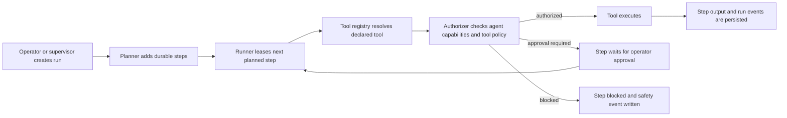

# Hydra Agent Runtime V1

Hydra Agent is the clean runtime continuation of Hydra-X. It deliberately drops
the old product-management workspace and keeps the core advantage: durable,
inspectable, policy-governed agents.

## Core Model

- **Workspace**: the security and knowledge boundary for agents, runs, graph data, providers, and policies.
- **Agent profile**: a specialized worker or supervisor with its own role, prompt, model route, skills, memory scopes, knowledge scopes, and capability profile.
- **Run**: the durable unit of autonomous work. Runs contain steps, approvals, outputs, errors, tool summaries, and recovery state.
- **Run event**: append-only timeline entries for run and step changes. These are the control-plane audit trail.
- **Conversation**: channel-specific interaction history, optionally linked to a run.
- **Room**: a workspace-scoped shared transcript where users can talk to one or
  more agents through the web UI or an external channel such as Telegram. Each
  agent response still writes through a private durable conversation for memory,
  usage, provider routing, and safety compatibility.
- **Knowledge graph**: workspace-scoped nodes and relationships for evidence, memories, artifacts, risks, decisions, task context, and source-grounded facts.
- **Skill**: durable workspace instruction package with trigger conditions, required tools, eval metadata, and a lifecycle.
- **Skill usage event**: evidence that a skill matched or should have matched a
  run, conversation, or room thread.
- **Skill improvement proposal**: governed create/refine/prune record produced
  by the learning loop before a skill changes.
- **Standard skill pack**: idempotent workspace seed set for common Hydra
  workflows such as run triage, repository review, research synthesis, memory
  curation, and handoff.
- **Skill experiment**: safe autonomous comparison of multiple read-only skill
  variants against generated and real-example eval evidence, optionally
  producing a winning refinement proposal.
- **Project-local code skill**: Hermes-compatible `SKILL.md` directory under a
  workspace project root, tracked as a Hydra skill with policy/provenance and
  executed through the approval-sensitive `project_skill_run` tool.
- **Tool policy**: least-privilege grants for tools and side-effect classes.
- **Safety event**: workspace-scoped security, approval, provider, policy, and runtime incident records.

## Execution Flow



## Security Defaults

Agents are read-only unless their pack and policy explicitly grant more.
Dangerous side effects include workspace writes, shell, browser, network, MCP,
external delivery, and plugin installation. Any dangerous grant must require
approval by default.

Run steps use leases with heartbeats. A runner must acquire a lease before it
can execute a step, and stale leases can be recovered back to `planned` or
marked `failed` after the configured attempt limit. This is the first OTP-shaped
runtime advantage: many workers can compete for work without double-executing a
step.

Parallel-safe read steps can also be leased in bounded batches. The batch
runner only selects planned steps whose tool metadata is `parallel_safe: true`
and whose side-effect class is `read_only`, then executes them with
`Task.async_stream/3` under a configurable concurrency limit. Sensitive,
network, shell, browser, MCP, and write actions stay on the single-step
authorization and approval path.

Runs can also be driven by supervised OTP workers. A run worker leases and
executes one step at a time, continues while work completes successfully, and
stops cleanly when approval, policy blocks, or failures need operator attention.
The durable database state remains the source of truth; the process is only the
active execution vehicle. Operators can explicitly stop a worker, and canceling
a run also attempts to terminate the active worker process.

A background recovery worker periodically scans active workspaces for expired
step leases and returns them to `planned` or marks them failed after the
configured attempt limit.

## Providers

Provider configs are workspace-scoped or global rows that agents reference by
name in their `model_route`. V1 includes these adapters:

- `mock`: local deterministic adapter for tests and dry runs.
- `openai_compatible`: OpenAI-compatible chat, true SSE streaming, embeddings,
  models, and health.
- `anthropic`: Anthropic Messages API chat and health.
- `ollama`: local Ollama chat, embeddings, models, and health.

Provider adapters return normalized maps with `message`, `usage`, `provider`,
and `model` fields where possible. API keys are referenced through environment
variable names in `api_key_env`; raw provider secrets should not be stored in
the database.

## Agent Chat

Agent chat is provider-backed and durable:

1. Hydra appends the user turn to the conversation.
2. Hydra recalls relevant workspace memory from the knowledge graph.
3. Hydra builds provider messages from the agent system prompt, memory context,
   recent turns, and current user message.
4. Hydra routes through the agent's `model_route`.
5. Hydra appends the assistant turn with provider, model, usage, and memory
   metadata.
6. Provider failures are written to the safety ledger.

This gives Hydra a Hermes-like conversational loop while preserving the runtime
properties that matter for teams: inspectable turns, provider routing, memory
provenance, and failure records.

## Agent Rooms

Rooms provide the first team-chat layer for Hydra agents. A room has members,
mention handles, a coordinator agent, a shared transcript, and optional channel
bindings. User messages are persisted to `agent_room_messages` and routed by:

1. explicit `@mention` handles;
2. coordinator fallback when the room has a coordinator;
3. priority fallback to the first active responding member.

When more than one agent is explicitly mentioned, Hydra creates a system
proposal instead of fanning out automatically. This preserves the V3
chat-plus-approval posture until an operator approves multi-agent fan-out.

Telegram bindings are the first external channel implementation. A binding maps
a Telegram chat id and webhook slug to a room, verifies optional env-backed
secrets, deduplicates inbound Telegram message ids, and sends agent replies
back through env-backed bot token refs when configured. Delivery state is tracked
with a cursor in binding metadata so failed sends can be retried without
replaying already delivered room replies.

Agent Studio exposes room creation, room member management, shared room chat,
pending multi-agent proposal approval, transcript export, Telegram binding
creation, retry/error controls, and a guided agent builder. The builder previews
the derived policy before creation, then creates an agent profile and matching
tool policy from product-level presets such as coordinator, researcher,
builder, reviewer, and memory curator.

The chat path also supports streamed provider deltas through
`AgentChat.stream_respond/3`. Deltas are broadcast on workspace and conversation
PubSub topics as `{:conversation_delta, conversation, delta}` messages, while
the completed assistant message is still persisted as a normal turn with usage
metadata. The HTTP endpoint returns the final response, and LiveView/control
planes can subscribe to the same PubSub topics for progressive rendering.

## Provider-Backed Planning

Runs can now generate durable step plans through their supervisor agent. Hydra
asks the supervisor for strict JSON, parses and validates the tool references,
then persists the result through the same runner path used by manually supplied
plans. This keeps LLM planning useful without letting it bypass registered
tools, side-effect classes, leases, or approval gates.

When a plan omits `assigned_agent_id`, the runtime uses
`HydraAgent.Runtime.AgentMatcher` to choose an active worker by tool grants,
side-effect classes, requested role, and requested skills. Explicit assignments
are preserved. This keeps planner output flexible while making delegation
inspectable and deterministic.

## Automations

Automations are workspace-scoped cron schedules that send prompts to an agent.
Each automation stores its agent, cron expression, prompt, next run time, last
run time, last output refs, and last error. A supervised worker checks for due
automations and uses the normal agent chat path, so scheduled work still gets
durable conversation turns, provider routing, memory recall, and safety records.
Each automation execution also creates a runtime `Run` with automation metadata,
then completes or fails that run with the conversation/error result so scheduled
work can be inspected through the normal Run Detail audit trail.
The Automations control surface shows structured failure detail and recent
conversation metadata for per-run triage, plus run-linked execution history
with Run Detail links and recurring execution analytics. Its schedule preview
shows the next five matching runs in the selected timezone with UTC cross-checks.

By default, Elixir only ships with `Etc/UTC` timezone support. Deployments that
need named local zones such as `America/New_York` should add a timezone database
dependency such as `tzdata` and configure:

```elixir
config :elixir, :time_zone_database, Tzdata.TimeZoneDatabase
```

Without that configuration, Hydra intentionally rejects unsupported timezone
names instead of silently evaluating schedules as UTC.

## Gateways

Webhook endpoints let external systems trigger Hydra without storing shared
secrets in the database. Each webhook stores a `token_env` reference and accepts
Bearer tokens only when the runtime environment variable matches. V1 webhooks
can target `agent_chat` or `run_create`.

## Audit Export

Workspace audit export returns agents, providers, tool policies, registered
tools, runs, run events, safety events, automations, webhooks, and eval suites
as one JSON report. Secret values are never included; only safe env refs are
shown.

## Usage Ledger

Hydra records provider usage for chat, planning, and eval execution. Usage rows
are workspace-scoped and can link back to agents, runs, run steps,
conversations, and turns. The ledger stores normalized provider/model names,
token counts, status, latency/cost fields, and route metadata so future routing
can use health, cost, and latency signals without scraping conversation logs.

## Budgets

Budgets are workspace-scoped, optionally agent-scoped limits over usage
categories such as chat, planning, eval, embedding, and tools. V1 exposes budget
records with live token-usage status over daily, weekly, monthly, or total
periods. Chat, eval, and planning provider calls perform a lightweight preflight
check and fail before spending more tokens when an applicable active budget is
already exceeded. Budget-aware model routing can build directly on this schema.

## Approval Queue

Steps that pass capability and policy checks but still require human approval
move to `awaiting_approval` and release their lease. The workspace approval
queue returns these steps with run and assigned-agent context, so a control
plane can render a single operator inbox instead of forcing users to inspect
each run manually.

## Doctor Checks

`HydraAgent.Doctor` provides fast operational diagnostics for CI, deploy
verification, and the control plane. It checks database connectivity, tool
registry uniqueness, starter pack validity, expected OTP process names, and,
when scoped to a workspace, provider health. The report collapses checks into
`ok`, `warning`, or `error` without exposing secrets.

## Real-Time Events

Runtime state changes broadcast through `HydraAgent.Runtime.PubSub` on stable
workspace, run, and conversation topics. This gives LiveView and external
control planes a clean way to subscribe to run events, run updates, and new
conversation turns without polling.

The first operator control plane is a standard Phoenix LiveView/Tailwind screen
at `/control`. It selects a workspace, subscribes to runtime PubSub events, and
shows dense panels for runs, approvals, usage, budgets, safety events,
providers, and recent knowledge graph nodes. Operators can start, pause,
resume, cancel, start/stop workers, and approve/reject pending steps from this
LiveView. It intentionally avoids a separate React frontend for V1.

## Memory Curation

The memory layer includes a curation pass for low-confidence memories and
duplicate titles. V1 supports dry-run reporting and optional archival of active
nodes below a confidence threshold. Memory Studio exposes that low-confidence
archive path as a configurable-threshold bulk operator action and records
archived time, actor, reason, and threshold on each affected memory node.
Duplicate active/verified memory titles can also be resolved in bulk by keeping
the strongest canonical memory and archiving lower-ranked duplicates with the
canonical node id in archive metadata.

Workspaces can seed neutral knowledge type definitions for sources, artifacts,
observations, claims, entities, events, decisions, tasks, risks, memories, and
common relationships such as `references`, `supports`, `contradicts`,
`derived_from`, `produced_by`, `depends_on`, `relates_to`, and `resolves`. The
seed helper is idempotent and avoids product-management vocabulary.

These seeds are not a fixed Hydra ontology. They are starter type definitions
that workspaces and agent packs can extend. `task` nodes represent discovered
follow-up work or external tasks; durable execution state remains in `RunStep`.
Source and artifact nodes require provenance from their corresponding tools, and
relationship creation enforces basic semantic guardrails for evidence links.

## Evals

Eval suites, cases, runs, and results are first-class runtime data. This is the
foundation for proving Hydra is at least as good as Hermes on measurable tasks:
provider failover, tool safety, memory recall, planning quality, recovery, and
latency can all become repeatable suites instead of ad hoc manual checks.

V1 scoring supports simple `expected.contains` assertions, exact tool-decision
JSON, JSON-path assertions, graph assertions, policy assertions, latency
thresholds, token-cost thresholds, and model-graded rubric-style cases. Rubric
cases can consume a model-emitted score or deterministically score required
content/path criteria, which keeps benchmark cases useful in both local mock
runs and provider-backed evals.

Eval runs also expose benchmark-style reports with pass rate, average score,
timing, and failed/errored case slices. These reports are intentionally shaped
for comparing agents, providers, prompts, and runtime changes over time.
Workspaces can also request a benchmark aggregate grouped by suite
`metadata.benchmark_category` or `metadata.category`, making it possible to
track safety, recovery, orchestration, memory, cost, and latency suites through
one report. A workspace can seed standard V1 benchmark suites for orchestration,
safety, recovery, memory recall, cost, and latency through the API.

## Agent Packs

Agent packs are versioned declarations that can be imported, audited, tested,
and shared. The V1 validation contract is implemented in `HydraAgent.AgentPack`;
YAML parsing can be added later without changing the normalized pack shape.
Agents can also be exported back into pack JSON so teams can move specialized
agents between workspaces or repos without copying database rows.
Imported packs preserve declared skills in the agent capability profile so
exported packs round-trip without silently dropping specialization metadata.

## Skill Learning Loop

Hydra can now record skill usage and create improvement proposals from completed
multi-tool runs. The first learning worker scans completed/failed runs, creates
usage evidence, drafts a proposed skill from the observed procedure, and stores
an improvement proposal with confidence, source run, and evaluation metadata.

Safe auto-activation is intentionally narrow. A proposal can auto-activate only
when the workspace skill autonomy policy allows it, the skill requires only
read-only tools, confidence meets the policy threshold, and the evaluation report
meets minimum pass-rate and case-count thresholds. Dangerous skills remain draft
proposals for operator review.

Skills can also be exported and imported as Markdown while preserving Hydra's
durable lifecycle, versions, tool validation, and provenance.

## V4 Tool Breadth

Hydra's tool registry now includes MVP breadth tools inspired by Hermes but kept
inside Hydra's policy boundary:

- browser intent tools for navigate/click/type/screenshot/extract;
- vision input validation;
- artifact-backed image generation and text-to-speech requests;
- bounded local code execution, including project-local code skill entrypoints;
- multi-model consensus across configured providers.

These are normal tools: they declare side-effect classes, run through tool
policy, write run events when used by the runner, and are grouped into named
bundles for controlled agent creation.

Required pack fields:

- `agent_pack_version`
- `slug`
- `name`
- `role`
- `description`
- `model_route`
- `tools`
- `skills`
- `memory_scopes`
- `knowledge_scopes`
- `permissions`
- `autonomy`
- `approval_policy`

The pack validator rejects unknown roles, unknown registered tools, malformed
scope lists, unsupported autonomy levels, unsupported side-effect classes, and
dangerous side effects without approval.

## Skills

Skills are runtime objects with explicit lifecycle states:

- `proposed`: generated or imported, not trusted yet.
- `testing`: being evaluated against examples or previous runs.
- `active`: available to agents through their skill scopes.
- `deprecated`: kept for provenance but no longer preferred.
- `archived`: retained for audit/history.

Skill records include trigger conditions, instructions, required tools,
memory/knowledge scopes, eval metadata, and provenance back to a source run
when available. This gives Hydra a learning loop similar in spirit to Hermes,
but with operator approval and durable auditability as first-class runtime
features.

## Built-In Tools

- `knowledge_search`: read-only search over workspace knowledge nodes.
- `knowledge_read`: read-only fetch of one knowledge node.
- `knowledge_write`: creates a knowledge node and requires `workspace_write`.
- `relationship_create`: creates a graph relationship and requires `workspace_write`.
- `source_ingest`: records a source node with provenance and requires `workspace_write`.
- `artifact_record`: records an output artifact node with provenance and requires `workspace_write`.
- `file_list`: lists workspace files and requires filesystem allowlist access.
- `file_read`: reads workspace files and requires filesystem allowlist access.
- `file_write`: writes workspace files and requires filesystem allowlist access plus `workspace_write`.
- `http_fetch`: fetches HTTP/HTTPS resources and requires `network`.
- `shell_command`: runs non-interactive argv commands and requires `shell`.
- `noop`: returns the input payload; useful for runner smoke tests and plan scaffolding.

The registry is intentionally small. External shell, browser, MCP, HTTP, and
delivery tools should be added as explicit modules with narrow specs and policy
metadata instead of being treated as generic execution escape hatches.
Each tool declares input/output schemas, a side-effect class, approval
sensitivity, timeout, and parallel-safety metadata. The registry enforces
timeouts around execution.

Network tools fail closed. Even when an agent capability profile includes the
`network` side-effect class, the authorizer blocks URL inputs unless a matching
tool policy grants the host through `network_allowlist`. Exact host names,
leading-dot suffixes such as `.example.com`, wildcard suffixes such as
`*.example.com`, and `*` are supported.

Shell tools also fail closed. Commands must be supplied as argv arrays, not raw
shell strings, and the authorizer requires a matching `shell_allowlist` prefix
such as `git status` or `mix test`. The execution tool constrains `cwd` to the
workspace root supplied by the run metadata.

Filesystem tools are scoped to a workspace root and additionally require
matching `filesystem_allowlist` entries. `filesystem_denylist` entries override
allowlist matches for sensitive paths.

## Control API Highlights

JSON APIs are open by default for local development. Deployments can require
env-backed Bearer authentication by setting `HYDRA_API_AUTH_REQUIRED=true` or
`HYDRA_API_TOKEN_ENV`. When enabled, the API plug verifies `Authorization:
Bearer ...` against the configured environment variable and fails closed if the
token reference is missing.

- `GET /api/v1/doctor`: run global runtime doctor checks.
- `GET /control`: LiveView operator control plane.
- `GET /api/v1/workspaces/:workspace_id/doctor`: run workspace-scoped doctor checks including providers.
- `POST /api/v1/runs`: create a run.
- `GET /api/v1/workspaces/:workspace_id/missions`: list missions.
- `POST /api/v1/workspaces/:workspace_id/missions`: create a mission with
  success criteria, context, team, permissions, budget, deadline, priority, and
  start mode.
- `GET/PATCH /api/v1/workspaces/:workspace_id/missions/:id`: inspect or update
  a mission with workspace ownership checks.
- `POST /api/v1/workspaces/:workspace_id/missions/:id/start`: create the first
  mission run and optionally start a supervised worker.
- `GET /api/v1/workspaces/:workspace_id/conversations`: list conversations.
- `POST /api/v1/conversations/:id/messages`: send a message through an agent.
- `POST /api/v1/conversations/:id/stream`: send a message and broadcast streamed deltas.
- `POST /api/v1/agents/:id/chat`: start a conversation with an agent and send a message.
- `GET /api/v1/agents/pack_schema`: return the generated Agent Pack V1 JSON Schema.
- `GET /api/v1/agents/starter_packs`: list bundled starter packs with connector,
  automation, room, and delivery metadata.
- `POST /api/v1/workspaces/:workspace_id/agents/import_pack`: import an agent pack.
  Supports `mode=create`, `mode=dry_run`, `mode=update_existing`, and
  `mode=clone`; validation failures include stable structured details.
- `GET /api/v1/agents/:id/export_pack`: export an agent as a pack.
- `GET /api/v1/workspaces/:workspace_id/automations`: list scheduled automations.
- `POST /api/v1/automations/:id/run`: run an automation immediately.
- `GET /api/v1/workspaces/:workspace_id/webhooks`: list webhook gateways.
- `POST /api/v1/webhooks/:slug`: receive an external webhook with Bearer auth.
- `GET /api/v1/workspaces/:workspace_id/audit/export`: export workspace audit JSON.
- `POST /api/v1/workspaces/:workspace_id/knowledge/type_definitions/seed`: seed neutral graph types.
- `POST /api/v1/workspaces/:workspace_id/memory/curate`: inspect or archive low-confidence memory.
- `GET /api/v1/workspaces/:workspace_id/usage`: list usage records and token summary.
- `GET /api/v1/workspaces/:workspace_id/budgets`: list budgets with usage status.
- `POST /api/v1/workspaces/:workspace_id/budgets`: create a workspace budget.
- `GET /api/v1/workspaces/:workspace_id/approvals`: list steps awaiting approval.
- `GET /api/v1/workspaces/:workspace_id/eval_suites`: list eval suites.
- `POST /api/v1/eval_runs/:id/execute`: execute an eval run.
- `GET /api/v1/eval_runs/:id/report`: return benchmark-style eval metrics.
- `GET /api/v1/workspaces/:workspace_id/evals/benchmark`: return a workspace benchmark aggregate grouped by eval suite category.
- `POST /api/v1/workspaces/:workspace_id/evals/benchmarks/seed`: idempotently create the standard V1 benchmark suites and cases.
- `GET /api/v1/workspaces/:workspace_id/skills/usage`: list observed skill usage events.
- `GET /api/v1/workspaces/:workspace_id/skills/improvement_proposals`: list governed skill create/refine/prune proposals.
- `POST /api/v1/workspaces/:workspace_id/skills/propose_from_run/:run_id`: create a learning proposal from a run.
- `POST /api/v1/workspaces/:workspace_id/skills/propose_from_conversation/:conversation_id`: create a learning proposal from a conversation transcript.
- `POST /api/v1/workspaces/:workspace_id/skills/propose_from_room/:room_id`: create a learning proposal from a shared room transcript.
- `POST /api/v1/workspaces/:workspace_id/skills/seed_pack`: idempotently seed the standard V4 skill pack.
- `POST /api/v1/workspaces/:workspace_id/skills/code_skill`: create a project-local code skill directory and durable skill record.
- `POST /api/v1/workspaces/:workspace_id/skills/import_directory`: import a local Hermes-style `SKILL.md` directory.
- `GET /api/v1/workspaces/:workspace_id/connectors`: list connector accounts with readiness and permission grants.
- `POST /api/v1/workspaces/:workspace_id/connectors/:id/agent_grants`: grant an agent an explicit connector write permission.
- `POST /api/v1/workspaces/:workspace_id/connectors/:account_id/actions`: request a connector action; agent writes require a matching grant.
- `GET /api/v1/workspaces/:workspace_id/skills/experiments`: list skill experiments.
- `POST /api/v1/skills/:id/eval_suite`: generate or refresh a per-skill eval suite and attach activation metadata.
- `POST /api/v1/skills/:id/experiments`: run a safe skill variant experiment and select a winner.
- `POST /api/v1/skills/:id/improvement_proposals/refine`: draft a governed refinement proposal.
- `POST /api/v1/skills/:id/improvement_proposals/prune`: draft a governed pruning proposal.
- `POST /api/v1/skill_improvement_proposals/:id/approve` and `/reject`: review a skill improvement proposal.
- `GET /api/v1/workspaces/:workspace_id/runs/:id/trace`: export a
  workspace-checked trace bundle with lineage, events, safety, usage,
  checkpoints, memory, artifacts, and graph relationships.
- `POST /api/v1/runs/:id/plan`: append durable steps.
- `POST /api/v1/runs/:id/generate_plan`: ask the supervisor agent to create durable steps.
- `POST /api/v1/runs/:id/start`: mark a run running.
- `POST /api/v1/runs/:id/execute_next`: authorize and execute the next planned step.
- `POST /api/v1/runs/:id/execute_parallel`: execute a bounded batch of parallel-safe read steps.
- `POST /api/v1/runs/:id/start_worker`: start a supervised OTP worker for the run.
- `POST /api/v1/runs/:id/stop_worker`: stop a supervised OTP worker for the run.
- `POST /api/v1/runs/:id/steer`: add operator steering without losing history.
- `POST /api/v1/runs/:id/pause`, `/resume`, `/cancel`: explicit run control.
- `POST /api/v1/runs/:id/steps/:step_id/approve`: release a step waiting for approval.
- `GET /api/v1/tools`: list built-in tools and their authorization metadata.
- `GET /api/v1/tools/bundles`: list named tool-bundle policy templates.
- `GET /api/v1/workspaces/:workspace_id/tool_policies`: inspect tool policies.
- `GET /api/v1/workspaces/:workspace_id/tool_policies/:id`: inspect one policy
  with workspace ownership checks and dangerous-posture warnings.
- `POST /api/v1/tool_policies`: create explicit tool grants and allowlists.
  Accepts `tool_bundles`; bundles expand to explicit tools and side-effect
  classes, but runtime authorization still checks agent capabilities and
  host/path/shell allowlists per tool call.
- `GET /api/v1/workspaces/:workspace_id/mcp_servers`: list inert MCP server
  records with env refs, filters, trust level, health, and approval sensitivity.
- `POST /api/v1/workspaces/:workspace_id/mcp_servers`: create validated MCP
  server records. Inline secret-like config keys are rejected; use env refs.
- Built-in `mcp_call` tool: calls active HTTP MCP servers through JSON-RPC
  `tools/call` after agent capability checks, policy grants, server
  include/exclude filters, and approval gating. It writes redacted
  `mcp.call.*` run events. SSE MCP transport can also execute JSON-RPC tool
  calls from event-stream responses through the same audit path.
- Stdio MCP servers can opt into supervised persistent sessions with
  `config.persistent`. Persistent sessions reuse the same subprocess across
  calls, keep cwd/env fencing, preserve timeout/error handling, expire after an
  idle timeout, and can be stopped explicitly by server id. Tools And Protocols
  shows persistent session active/inactive status, request count, last-used
  time, idle timeout, and a stop control.
- MCP discovery refreshes HTTP and stdio server `tools/list` metadata, plus
  optional `resources/list` and `prompts/list` when those access flags are
  enabled. Refreshes update health status, checked time, discovery metadata, and
  redacted last-error details for operator review.
- Built-in file and shell tools enforce workspace-root checks, bounded file
  reads, binary-read refusal by default, create-new write conflicts, optional
  SHA preconditions, and shell output truncation metadata.
- `GET /api/v1/workspaces/:workspace_id/providers`: list provider configs.
- `GET /api/v1/workspaces/:workspace_id/credential_pools`: list env-backed
  credential pools and per-key item health.
- `POST /api/v1/workspaces/:workspace_id/credential_pools`: create a pool.
- `POST /api/v1/workspaces/:workspace_id/credential_pools/:id/items`: add a
  rotatable credential item to a workspace-owned pool.
- `GET /api/v1/providers/:id/health`: check provider readiness.
- `GET /api/v1/providers/:id/models`: list provider models when supported.
- `GET /api/v1/workspaces/:workspace_id/checkpoints`: list tool checkpoints.
- `GET /api/v1/workspaces/:workspace_id/checkpoints/:id/diff`: preview a
  checkpoint diff with workspace ownership checks.
- `POST /api/v1/workspaces/:workspace_id/checkpoints/:id/restore`: restore a
  checkpoint with workspace ownership and workspace-root checks.
- `GET /api/v1/workspaces/:workspace_id/skills`: list workspace skills.
- `POST /api/v1/skills/:id/test`, `/activate`, `/deprecate`, `/archive`: move skills through their lifecycle.
- `GET /api/v1/workspaces/:workspace_id/safety/events`: inspect policy and approval events.
  Accepts `run_id` to scope the safety ledger to a single run timeline.
- `POST /api/v1/agents/:id/memory/proposals`: create a draft memory proposal
  with agent/run provenance. Draft proposals are excluded from recall until
  promoted through knowledge curation.
- `GET /api/v1/workspaces/:workspace_id/memory/proposals`: list pending memory
  proposals for review.
- `POST /api/v1/memory/proposals/:id/promote`, `/reject`: complete proposal
  review by promoting the node to active recall or archiving it.

## Near-Term Build Order

The complete continuation plan lives in
[`docs/implementation-roadmap.md`](implementation-roadmap.md). The management
interface plan and Hermes comparison live in
[`docs/management-interface.md`](management-interface.md) and
[`docs/hermes-gap-review.md`](hermes-gap-review.md).

1. Add DB-backed runner/worker integration fixtures. Done.
2. Test pause/cancel/approval/failure/recovery semantics. Done.
3. Expand persisted run events enough to render a real Run Detail timeline.
   Done for the first route: `/control/runs/:id` renders ordered steps, runtime
   events, run-scoped safety events, approvals, and worker state.
4. Split `/control` into management surfaces. Done for the first V1 surfaces:
   Mission, Run Detail, Agent Directory/Detail, Memory Studio, Graph Workbench,
   Runtime Operations, Skills Registry/Detail, Automations, and Tools/Protocols
   now share a
   reusable LiveView shell and navigation. Skill Detail also surfaces
   owner-agent usage, attached eval run reports with failure drill-downs,
   proposal editing, activation readiness cues, validated advanced metadata
   JSON editing, version history with changed-field diffs, eval run comparisons,
   and activation override reporting. The registry summarizes thresholded,
   passing, blocked, and overridden skills across the workspace. Skills with
   declared eval thresholds are activation-gated until the latest attached eval
   run meets the threshold unless an operator records an explicit activation
   override with provenance.
   Automations also support attention filtering and clear-error triage.
   Run Detail can draft proposed skills from source runs for operator review.
   Run Detail can also draft pending memory proposals from source runs for
   Memory Studio review.
5. Deepen memory proposal and graph provenance workbench foundations. In
   progress: agents can create draft memory proposals with `memory_proposal`
   provenance, operators can promote/reject them from API or `/control` with
   review rationale, can edit pending proposal title/body/confidence/importance,
   can tune durable memory status/confidence/importance, and recall excludes
   drafts. Memory Studio also surfaces contradictory graph relationships as
   conflict signals, renders durable review/edit/archive history, and can bulk
   archive low-confidence active memories with audit metadata. `/control` also
   surfaces recent graph relationships, relationship in/out context, source-run
   links, and provenance labels.
   Graph Workbench can now tune graph node status/confidence/importance and
   relationship confidence/provenance in place, and can bulk verify filtered
   draft/active graph nodes plus bulk review filtered relationships with
   confidence and provenance audit metadata.
6. Add MCP tools behind strict allowlists and environment-isolated execution. In
   progress: named built-in tool bundles now exist as policy templates, MCP
   server config records are env-ref-backed and visible in `/control`/audit
   export, and HTTP plus bounded stdio MCP `tools/call` execution are audited
   with redacted events. Tools And Protocols can refresh HTTP/stdio MCP
   discovery and health metadata. SSE MCP execution is available for
   event-stream JSON-RPC responses. Persistent stdio sessions can reuse a
   supervised subprocess across calls, expire when idle, and show stop/status
   controls in Tools And Protocols.
7. Deepen Automation/Cron UI. The current route already supports create/edit
   forms, validation feedback, trigger-now, structured failure detail, last
   output references, run-linked execution history with Run Detail links,
   recurring execution analytics, five-run schedule previews with UTC
   cross-checks, matching safety policy summaries, recent run history with
   conversation metadata, and fail-closed validation plus setup documentation
   when the configured timezone database does not support a selected zone.
8. Add benchmark suites for orchestration, safety, recovery, memory recall,
   cost, and latency. Workspace benchmark report aggregation and standard V1
   benchmark seeding are available, with richer scoring for tool decisions,
   graph assertions, policy assertions, latency, and token cost.
